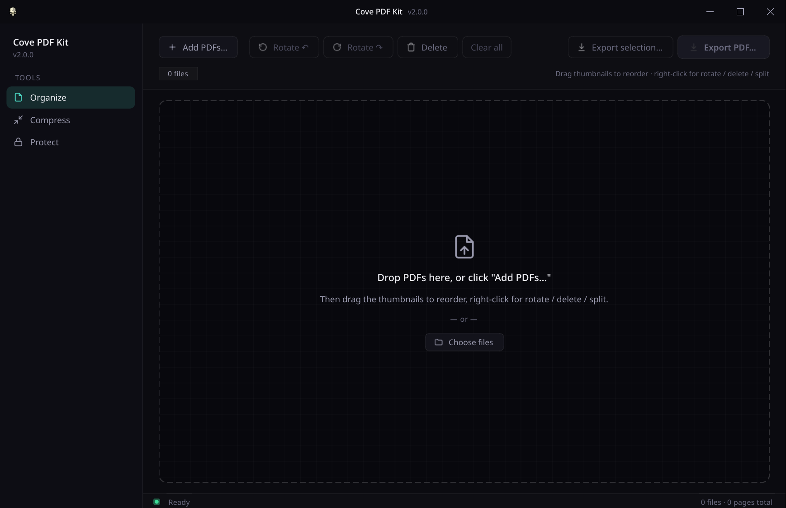

# Cove PDF Kit



A focused, offline PDF toolkit for **Linux** and **Windows**. No cloud,
no uploads, no account — drop your PDFs in, rearrange them, compress
them, protect them, done.

## Download (v2.0.0)

| Platform | File |
| -------- | ---- |
| Windows (installer) | `cove-pdf-kit-2.0.0-Setup.exe` |
| Windows (portable) | `cove-pdf-kit-2.0.0-Portable.exe` |
| Linux (AppImage) | `Cove-PDF-Kit-2.0.0-x86_64.AppImage` |
| Linux (Debian / Ubuntu) | `cove-pdf-kit_2.0.0_amd64.deb` |

Each artifact ships with a matching `.sha256` sidecar — verify with
`sha256sum -c <file>.sha256` before running.

Grab the artifacts from the [Releases page](https://github.com/Sin213/cove-pdf-kit/releases).

## Three tools, one app

### Organize
The flagship view. Drop one or more PDFs in and see every page as a
thumbnail in a grid. From here you can:

- **Merge** — every page of every dropped file lines up in order. Hit
  *Export PDF…* and you get a single merged document.
- **Reorder** — drag pages around the grid (multi-select with Ctrl /
  Shift). Build a new table-of-contents order without leaving the app.
- **Rotate** — right-click or use the toolbar to rotate selected pages
  90° left / right.
- **Delete** — pull pages you don't want before exporting. `Delete` /
  `Backspace` on the keyboard works too.
- **Split** — select the pages you *do* want, hit *Export selection…*.
  Any subset becomes a brand-new PDF.

### Compress
Drop any number of PDFs, pick *High / Balanced / Aggressive*, hit
*Compress*. Each file is rewritten with a Ghostscript `pdfwrite` pass
(`/printer`, `/ebook`, `/screen` respectively) when Ghostscript is
available, or a pikepdf + Pillow image-recompression pass otherwise.
Whichever backend produces the smaller file wins. If neither beats the
source — already-optimised PDFs, JPEG2000-heavy artbooks, etc. — the
output is a faithful copy of the original instead of a larger
"compressed" file. **The contract is simple: `output.size ≤ input.size`,
always.**

### Protect
Add a password to one or more PDFs, or remove it. Pure pikepdf; the
content is rewritten with AES-256 (`R=6`) when encrypting. Any non-empty
password is accepted.

## What's new in 2.0.0

A full visual redesign mirroring the rest of the Cove suite, plus a
batch of correctness fixes.

**Design**
- Frameless cove-style window with a custom titlebar (Windows-style
  min/max/close — no traffic-lights), teal-on-charcoal palette, Geist
  text + Geist Mono for technical metadata.
- Sidebar with iconified Organize / Compress / Protect navigation and
  live count badges.
- Per-tool layout: header + toolbar, drop-zone empty state, tabular file
  list with status dots (`idle / queued / running / done`), footer with
  thin progress bar, status bar.

**New behaviour**
- `Delete` / `Backspace` removes the current selection in the Organize
  grid.
- *Show folder* button appears after every successful export / compress
  / protect run — opens the output directory (Windows `explorer
  /select`, macOS `open -R`, Linux DBus `FileManager1.ShowItems` →
  `xdg-open` fallback).
- Real compression. Ghostscript `pdfwrite` is the primary backend; a
  pikepdf + Pillow image-recompression pass is the fallback. Whichever
  result is smaller (and smaller than the source) is published.
- Output never larger than input — applies to plain PDFs *and*
  password-protected PDFs (re-encryption overhead is checked
  post-encryption; if it pushed the file above source size, a
  bit-perfect copy of the original is delivered instead).
- Encrypted source → encrypted output. The password is required to read
  the input; we re-apply the same password after compression so the
  output's security properties match the input's.
- Compress / Protect batches are snapshotted at run start. Files dropped
  mid-run are rejected (with a clear status message) instead of being
  silently encrypted/decrypted with the active password.

**Security and reliability**
- Source PDF passwords never appear on Ghostscript's `argv`. The source
  is decrypted into a private temp directory and Ghostscript runs
  against the plain copy.
- `compress(src, dst)` rejects same-path arguments — input is never
  overwritten.
- Encrypted, corrupt, and wrong-password sources raise specific errors
  (`pikepdf.PasswordError`, `pikepdf.PdfError`) instead of being
  silently reported as "already optimised".
- Image rewrite now skips dictionaries we can't safely normalise
  (`/ImageMask`, `/SMask`, `/Mask`, `/Decode`, `/JPXDecode`,
  `/JBIG2Decode`); rewritten images get all dependent metadata
  (`/DecodeParms`, `/Decode`, `/SMask`, `/Mask`, `/SMaskInData`,
  `/Alternates`, `/OPI`) cleared so the new dictionary is internally
  consistent.
- Temp files use `tempfile.mkstemp` with private random names — no
  collision with user files that happen to share a predictable
  `<dst>.gs.tmp` / `<dst>.pp.tmp` shape.

**Release plumbing**
- Both build scripts read the version from `pyproject.toml` (single
  source of truth) and hard-fail with a clear message when neither an
  explicit `VERSION=` / `-Version` override nor a parseable
  `pyproject.toml` is available — no more silent `0.0.0` artifacts.

## Requirements

- Python 3.10+ (only for running from source)
- `PySide6`, `Pillow`, `pypdf`, `pikepdf`, `pypdfium2` — installed
  automatically by `pip`

**Ghostscript** is the highest-quality compression backend. The Windows
Setup.exe and Portable.exe ship a bundled copy (`gs/bin/gswin64c.exe` and
its libraries — see `gs/LICENSE` for the AGPL terms; the source tree
lives at <https://github.com/ArtifexSoftware/ghostpdl-downloads>). On
Linux, install your distro's `ghostscript` package for the same effect;
otherwise the pikepdf + Pillow fallback path runs and still compresses
real-world PDFs.

**No ffmpeg, no ML models, no internet access at runtime.**

## Running from source

```bash
pip install -e .
cove-pdf-kit
```

Or without installing:

```bash
PYTHONPATH=src python -m cove_pdf_kit
```

## Building release artifacts

### Linux (AppImage + .deb)

```bash
./scripts/build-release.sh
```

Reads the version from `pyproject.toml`. Override with `VERSION=…` if
you need a different label. Produces
`Cove-PDF-Kit-<version>-x86_64.AppImage` and
`cove-pdf-kit_<version>_amd64.deb` under `release/`.

### Windows (Setup.exe + Portable.exe)

Two paths:

**On Windows** — `.\build.ps1` (reads version from `pyproject.toml`;
pass `-Version <x.y.z>` to override). Requires Python 3.12+ and
[Inno Setup 6](https://jrsoftware.org/isdl.php).

**Cross-compile from Linux** — `bash .winebuild/build-windows.sh`. Uses
two Docker containers (`tobix/pywine:3.12` for PyInstaller under Wine,
`amake/innosetup` for `ISCC.exe`). Bundles Ghostscript so the resulting
.exes run on stock Windows machines without any external install. Needs
`docker` and `7z` on the host.

### GitHub Actions

Tagging a commit `vX.Y.Z` triggers `.github/workflows/release.yml`, which
produces all four artifacts and attaches them to a GitHub release.

## License

MIT — see [LICENSE](LICENSE).
